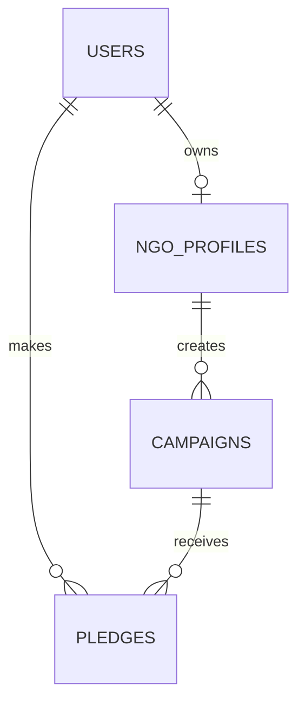

# PROMESA Project Documentation

## 1. Project overview

PROMESA is a donation campaign management system for SDG-focused NGOs. It replaces informal spreadsheet, email and social-media tracking with public campaign discovery, NGO and campaign review, and traceable donor pledge records. A pledge is a non-payment commitment recorded in Ghana cedi (GHS).

### Stakeholders

| Stakeholder | Primary need |
|---|---|
| Public visitor | Discover approved SDG campaigns |
| Donor | Record and review pledges |
| NGO representative | Submit an NGO profile and campaigns; view activity |
| System administrator | Review NGOs and campaign submissions |

## 2. SRS and prioritisation

**Must-have (MVP):** credentials login, Donor/NGO roles, seeded Administrator, NGO review, campaign review, SDG classification, public search/filtering, GHS pledge recording, histories, validation, responsive UI and deployment.

**Should-have:** campaign metrics, pledge acknowledgement/fulfilment, filtering administration views, seed demo data.

**Deferred:** payment processing, campaign-coordinator accounts/progress updates, notification emails, document uploads, donor receipts, advanced reporting and multi-currency.

### Non-functional requirements

The interface uses responsive solid-colour layouts with accessible contrast; passwords are bcrypt-hashed; authorization is enforced in server actions; input is validated with Zod; the application targets current browsers; and Neon provides managed PostgreSQL persistence.

## 3. Estimate and delivery scope

Wideband expert estimation was selected because this is a small, unfamiliar, individual 48-hour project with no reliable historic velocity. Estimated effort: requirements/design 8h, foundation/database/authentication 9h, user workflows 13h, testing/refinement 6h, deployment 4h, and documentation 8h, totalling **48 person-hours**.

Assumptions: a Neon database and Vercel account are available; email/password credentials are sufficient; pledges do not require payment processing; and a single administrator is seeded by secure environment credentials. Payment handling and coordinator updates are deliberately excluded to keep the major requirements demonstrably complete.

## 4. Design

Next.js renders pages and runs server actions. Auth.js issues JWT-backed sessions after credentials verification. Drizzle provides typed SQL access to Neon. Authorization occurs before every mutation; database foreign keys preserve pledge, campaign, NGO and user relationships.

## 5. Testing report template

| ID | Scenario | Expected result | Actual result | Status |
|---|---|---|---|---|
| T01 | Register Donor | Account is created with donor role | Pending deployment test | Not run |
| T02 | Submit NGO profile | Profile is pending admin approval | Pending deployment test | Not run |
| T03 | Approve campaign | Approved unexpired campaign becomes public | Pending deployment test | Not run |
| T04 | Record zero pledge | Validation rejects the pledge | Pending deployment test | Not run |
| T05 | Donor opens NGO dashboard | Access is denied | Pending deployment test | Not run |
| T06 | Mobile campaign catalogue | Controls remain usable at narrow widths | Pending deployment test | Not run |

Run `npm run lint` and `npm run build` before deployment. After deployment, repeat T01-T06 against the live URL and replace the final two columns with observed results.

## 6. Technical-debt plan

| Debt | Cause | Impact | Priority | Resolution |
|---|---|---|---|---|
| No payment collection | Scope constraint | Pledges are not transactions | Medium | Integrate a Ghana-supported payment provider with webhooks in v2 |
| No coordinator updates | Not a stated functional requirement | Less detailed campaign progress | Low | Add coordinator role and milestone model |
| Basic reporting | 48-hour scope | Limited operational insight | Medium | Add exportable, date-ranged dashboard reports |
| Manual admin seed | Small deployment model | Rotation needs an operational process | Medium | Add invite/recovery and audit logging |
| Initial automated coverage | Time-boxed implementation | Regression risk | Medium | Add Vitest, Playwright and CI before expansion |

## 7. User manual and operations

1. Visitors search approved campaigns by title or SDG.
2. Donors register, sign in, open a campaign and record a positive GHS pledge.
3. NGOs register, submit an organisation profile, await approval, then submit campaigns.
4. Administrators sign in with the seeded account and approve/reject NGO profiles and campaigns.

For deployment: create a Neon database; apply `drizzle/0000_initial.sql`; set the variables in `.env.example` on Vercel; set `NEXTAUTH_URL` to the Vercel URL; run `npm run seed:admin` once with `DATABASE_URL`, `ADMIN_EMAIL`, and `ADMIN_PASSWORD` set; deploy the repository; then perform live smoke tests. Source repository and live URL should be entered in the final LMS submission links file.

Maintenance includes corrective defect fixes, adaptive framework/dependency updates, perfective accessibility and reporting improvements, and preventive backup, security patching, database monitoring and credential rotation. Future evolution includes verified payments, notifications, coordinator updates, receipts, audit logs, analytics and feedback collection.
